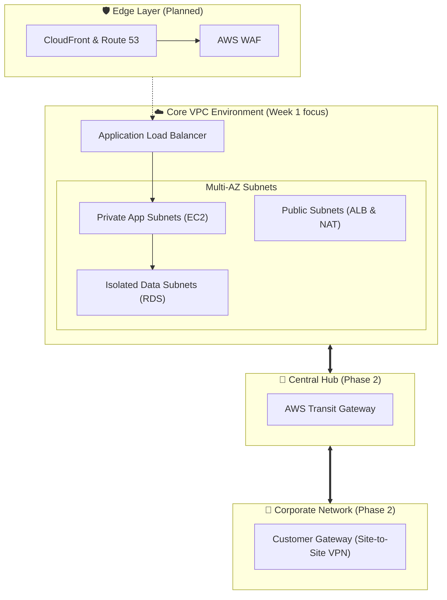

# DEPI Capstone Project: Secure AWS Network Architecture & Hybrid Connectivity

> **Program:** Digital Egypt Pioneers Initiative (DEPI)  
> **Track:** AWS Security Cloud Computing  
> **Status:** 🟡 Phase 0 — Project Proposal, Architecture Specification & Workspace Setup  
> **IaC Status:** ⚪ Not yet deployed — Week 1 implementation is planned, not built  

---

## 📌 Project Overview

This repository hosts the graduation capstone project for the **AWS Security Cloud Computing Track** under the **Digital Egypt Pioneers Initiative (DEPI)**.

Our team is designing and implementing a **Secure AWS Network Architecture with Hybrid Connectivity** modeled after enterprise-grade AWS Well-Architected Security principles. The goal is to build a reliable, segmented cloud network capable of securely interconnecting multiple environments, defending against web-layer threats, and detecting anomalous traffic.

---

## 🚦 Current State

The team has completed **Phase 0**:

- ✅ Project proposal and scope agreed
- ✅ Target architecture specified — [`architecture/README.md`](architecture/README.md)
- ✅ Week 1 design documented — [`docs/week-1-vpc-core.md`](docs/week-1-vpc-core.md)
- ✅ Repository workspace scaffolded (`docs/`, `terraform/`, `architecture/`, `.github/`)
- ⚪ **Terraform implementation: not started.** `terraform/` contains directory structure only.

**No infrastructure has been provisioned. No AWS resources exist yet.**

---

## 🎯 Target Architecture Vision

The target architecture is an enterprise **Hub-and-Spoke** topology designed to scale securely:



---

## 🚀 Next Milestone: Week 1 — Core VPC Foundation

Week 1 implements the network foundation described in [`docs/week-1-vpc-core.md`](docs/week-1-vpc-core.md).

### 📋 Week 1 Objectives & Deliverables
- [ ] **IP Addressing & CIDR Design:** `10.0.0.0/16` across 2 Availability Zones, with a documented allocation rule and reserved AZ-C blocks.
- [ ] **Multi-Tier Subnet Segmentation:**
  - Public Subnets for the ingress load balancer and NAT gateways.
  - Private Application Subnets for compute workloads.
  - Isolated Data Subnets with no default route to the internet.
- [ ] **Ingress & Egress Controls:** Internet Gateway (IGW) and managed NAT Gateways.
- [ ] **Least-Privilege Security Groups:** Strict chain `sg-alb` ➔ `sg-app` ➔ `sg-data`.
- [ ] **Secure Management Plane:** Eliminate public bastion jump-boxes and direct SSH port 22 access by adopting **AWS Systems Manager (SSM) Session Manager** over NAT.
- [ ] **Initial IaC Implementation:** Terraform module `01-vpc-core` — **planned, not yet written.**

---

## 🗺️ Project Roadmap (High-Level Phases)

| Phase | Milestone | Focus Area | Design | Implemented |
| :---: | :--- | :--- | :---: | :---: |
| **Phase 0** | **Proposal & Architecture** | Scope, target architecture, workspace setup | ✅ | ✅ docs + repo |
| **Week 1** | **Core VPC Foundation** | Multi-AZ Subnets, Routing, NAT, Security Groups & SSM | ✅ | ⚪ Planned |
| **Week 2** | **Hybrid Connectivity & Hub Routing** | AWS Transit Gateway, Site-to-Site VPN, VPC Endpoints | ✅ | ⚪ Planned |
| **Week 3** | **Edge Security & Application Protection** | Amazon CloudFront, AWS WAF, Route 53, ACM | ✅ | ⚪ Planned |
| **Week 4** | **Observability & Incident Response** | VPC Flow Logs, Athena Analytics & Host Isolation | ✅ | ⚪ Planned |

> **Design vs. Implemented** are tracked separately on purpose: the architecture has been
> specified ahead of the build, but no Terraform has been applied.

---

## 📁 Repository Structure

```text
depi-aws-network-architecture/
├── .github/                 # Pull request template (CI added once Terraform lands)
├── architecture/            # Target architecture spec & CIDR allocation plan
│   └── diagrams/            # Network diagrams (to be added)
├── docs/                    # Sprint deliverables & design notes
│   └── week-1-vpc-core.md
├── terraform/               # Infrastructure as Code workspace
│   ├── environments/        # Root modules per environment (dev/, prod/)
│   └── modules/             # Reusable modules (01-vpc-core/, …)
├── .gitignore               # Terraform & AWS credential ignore rules
├── CONTRIBUTING.md          # Team collaboration and branch conventions
└── README.md                # Project overview and milestone tracker
```

---

## 🌿 Team Workflow

To ensure smooth collaboration across the team:
- The `main` branch tracks verified, review-approved milestones.
- Work for the current sprint is developed in feature branches (e.g., `feat/week-1-vpc-subnets`).
- Each feature must be tested and reviewed before merging into `main`.
- See [`CONTRIBUTING.md`](CONTRIBUTING.md) for branch naming, commit conventions, and the PR process.

---

## 📜 Acknowledgments

Developed as part of the **Digital Egypt Pioneers Initiative (DEPI)**, sponsored by the **Ministry of Communications and Information Technology (MCIT)**, Egypt.
